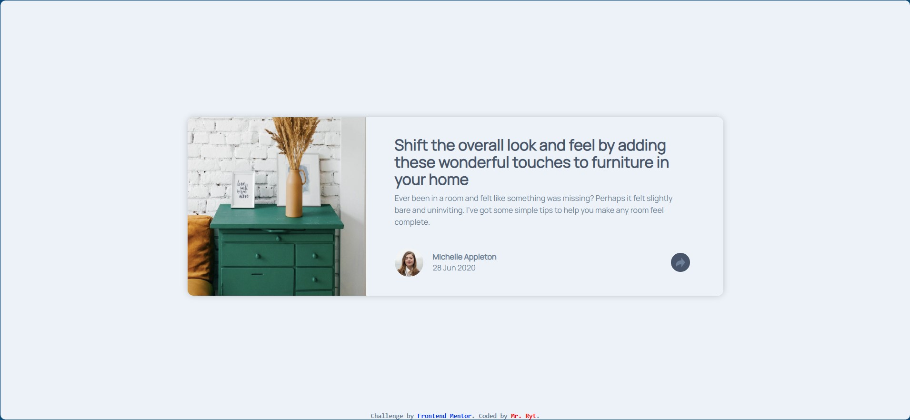
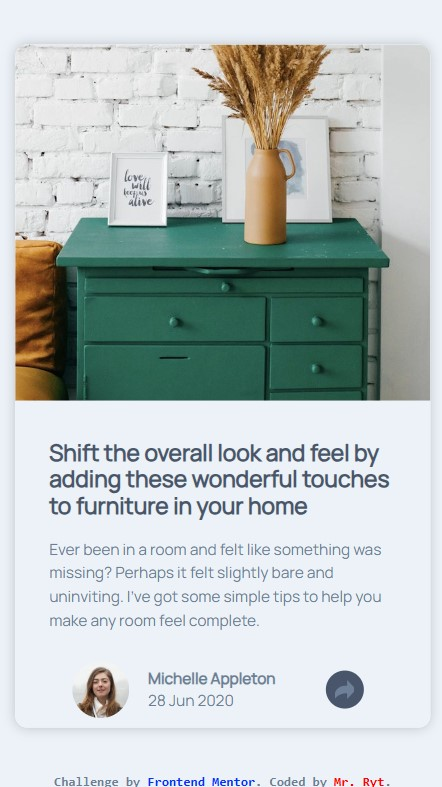

# Frontend Mentor - Article preview component solution

This is a solution to the [Article preview component challenge on Frontend Mentor](https://www.frontendmentor.io/challenges/article-preview-component-dYBN_pYFT). Frontend Mentor challenges help you improve your coding skills by building realistic projects.

## Table of contents

- [Overview](#overview)
  - [The challenge](#the-challenge)
  - [Screenshot](#screenshot)
  - [Links](#links)
- [My process](#my-process)
  - [Built with](#built-with)
  - [Continued development](#continued-development)
  - [Useful resources](#useful-resources)
- [Author](#author)
- [Acknowledgments](#acknowledgments)

## Overview

### The challenge

Users should be able to:

- View the optimal layout for the component depending on their device's screen size
- See the social media share links when they click the share icon

### Screenshot

- Solution URL: [https://github.com/MrRyt247/article-preview-component_fm.git](https://github.com/MrRyt247/article-preview-component_fm.git)
- Live Site URL: [https://mrryt247.github.io/article-preview-component_fm/](https://mrryt247.github.io/article-preview-component_fm/)

## My process

### Built with

- Semantic HTML5 markup
- CSS custom properties
- Flexbox
- jQuery

### Continued development

- jQuery

### Useful resources

- [Sololearn](https://www.sololearn.com) - A great app to learn web development. It helped me in gaining jQuery knowledge.

## Author

- Frontend Mentor - [@MrRyt247](https://www.frontendmentor.io/profile/MrRyt247)
- X - [@MrRyt19](https://www.twitter.com/MrRyt19)

## Acknowledgments

- Sololearn
